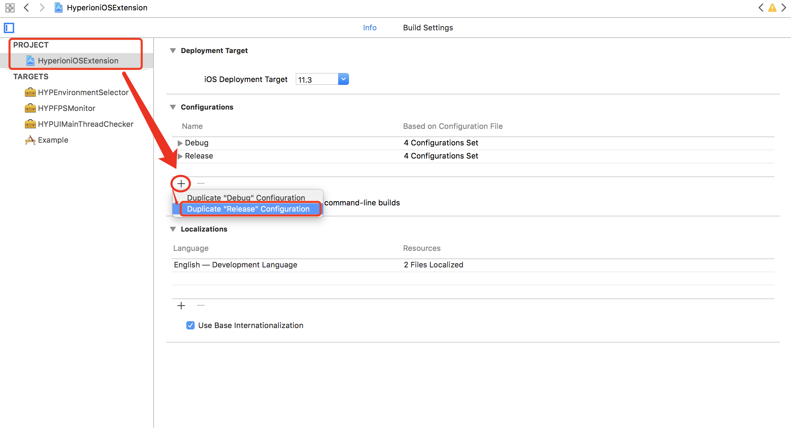
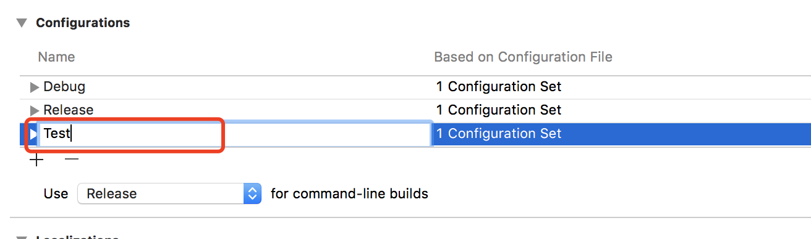
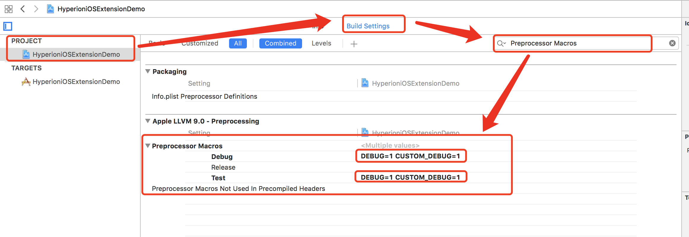
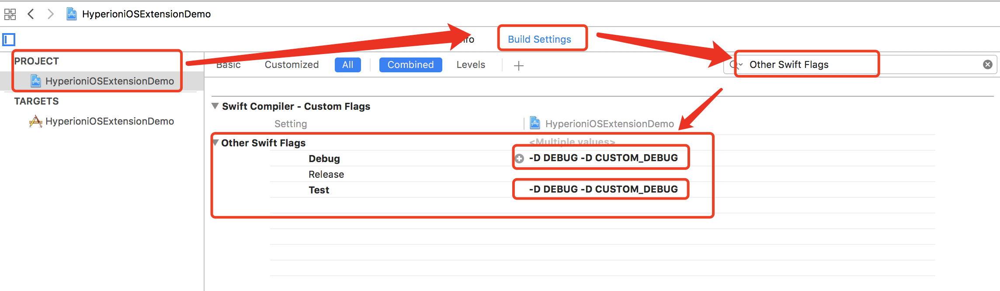
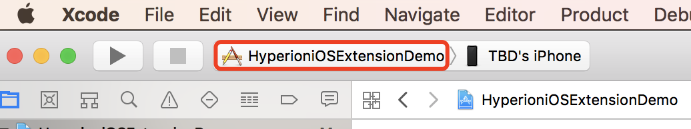
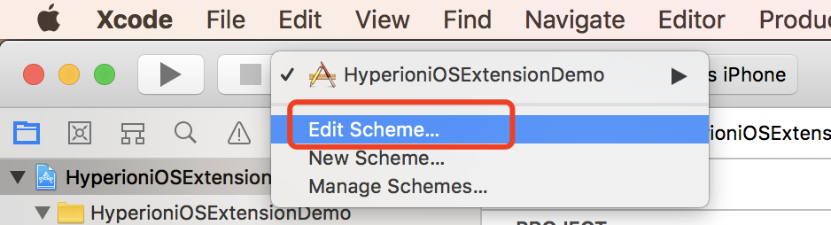
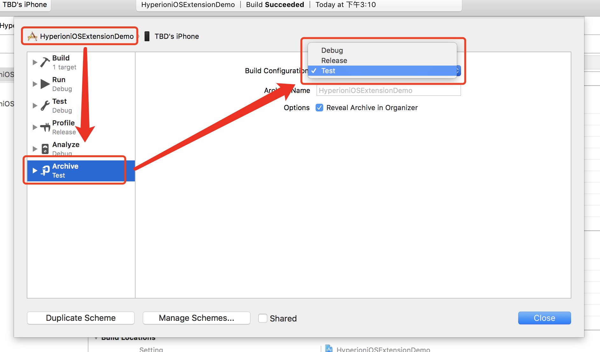

> [中文](Note_CN.md)

## Use caution

### If the first type of Pod is automatically imported during debugging

Need to add in all involved places is the Debug mode judgment

in `Podfile`:

```ruby
pod 'HyperioniOSExtension/......', :configurations => ['Debug']
```

`ObjC` Join the following judgment:

```objc
#ifdef DEBUG

// Debug Code

#else

// Release Code

#endif
```

If used in `Swift`: Add `-D DEBUG` in `Build Settings` | `Other Swift Flags`

`Swift` Join the following judgment:

```swift
#if DEBUG

// Debug Code

#else

// Release Code

#endif
```

### If You Want To Import when Debug Archiving (Archive)

When the package is imported, it is generally a test package import, and the release package is not imported. It is recommended to use the following method to add Configuration:`Debug Package`

#### Setting `Configurations`

1. Duplicate `release` Configuration



2. Change the duplicate Configuration name to `Debug Package`



3. Add `DEBUG=1 CUSTOM_DEBUG=1` to `Project`'s `Preprocesson Macros` in `Debug` and `Debug Package`



4. Add `-D DEBUG -D CUSTOM_DEBUG` to `Project`'s `Other Swift Flags` in `Debug` and `Debug Package`



#### Packing Operation

1. Click on the `Scheme` in the upper left corner of the `Xcode`.



2. Click `Edit Scheme...`



3. Click `Archive`, If you pack the test package, select `Build Configuration` as `Debug Package`; if you want to package the distribution package to App Store, select `Build Configuration` as `Release`.



4. change `Podfile` `is_debug` value to `true`(`Debug` or `Debug Package`) or `false`(`Release`), run `pod install`, the subsequent packaging operation is the same as before.

#### `Podfile`

```ruby
is_debug = true # or false
if is_debug
    pod 'HyperioniOSExtension/........'
end
```

#### Code Writing Requirements

`ObjC` Join the following judgment:

```objc
#ifdef CUSTOM_DEBUG

// Debug Code

#else

// Release Code

#endif
```

`Swift` Join the following judgment:

```swift
#if CUSTOM_DEBUG

// Debug Code

#else

// Release Code

#endif
```

