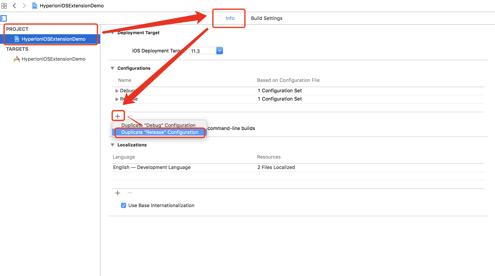
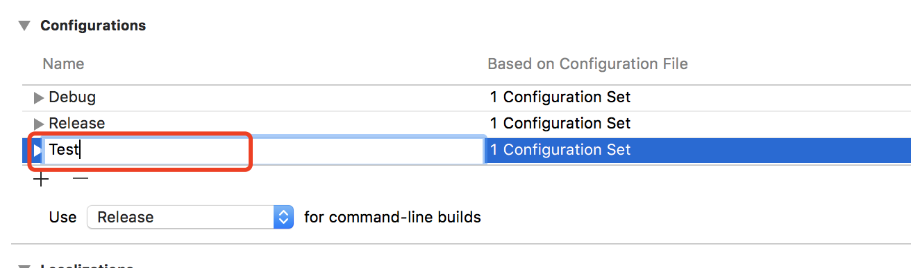
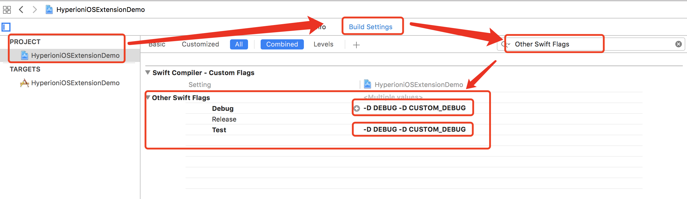
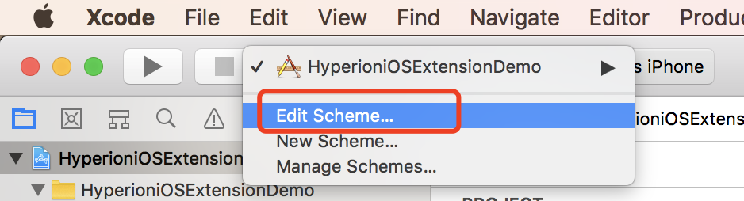
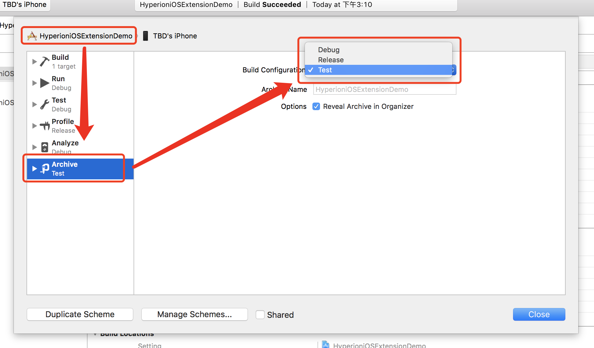

> [English](Note.md)

## 使用注意

### 如果采用第一种Pod自动在Debug时候导入

`Podfile`方式:

```ruby
pod 'HyperioniOSExtension/......', :configurations => ['Debug']
```

需要在所有涉及到的地方加入是否是Debug模式判断

`ObjC`加入以下判断:

```objc
#ifdef DEBUG

// Debug Code

#else

// Release Code

#endif
```

`Swift`加入以下判断:

如果在 `Swift` 中使用: 在 `Build Settings` | `Other Swift Flags` | 加入 `-D DEBUG`

```swift
#if DEBUG

// Debug Code

#else

// Release Code

#endif
```

### 如果想在打包测试包(Archive)时候导入

打包时候导入，一般是测试包导入，发布包中不导入，建议使用下面的方式添加Configuration：`Test`

#### 设置 `Configurations`

1. 复制`Release` or `Debug` Configuration (取决于你之前的测试包使用什么配置)



2. 将复制的`Configuration`名称改为 `Test`



3. 将`Project` 的 `Debug` 和 `Test` 的 `Preprocessor Macros` 添加 `DEBUG=1 CUSTOM_DEBUG=1`


4. 将`Project` 的 `Debug` 和 `Test` 的 `Other Swift Flags` 添加 `-D DEBUG -D CUSTOM_DEBUG`



#### 打包操作

1. 打包时候点击`Xcode`左上角的`Scheme`


2. 点击 `Edit Scheme...`



3. 点击`Archive`，若打包测试包，选择`Build Configuration` 为 `Test`；若打包发布包，选择`Build Configuration` 为 `Release`；



4. 如果使用`command-line` build 项目，需要选择具体build方式


5. 后续打包操作与之前相同。

#### `Podfile`

```ruby
pod 'HyperioniOSExtension/......', :configurations => ['Debug', 'Test']
```

#### 代码编写要求

`ObjC`加入以下判断:

```objc
#ifdef CUSTOM_DEBUG

// Debug Code

#else

// Release Code

#endif
```

`Swift`加入以下判断:

```swift
#if CUSTOM_DEBUG

// Debug Code

#else

// Release Code

#endif
```

